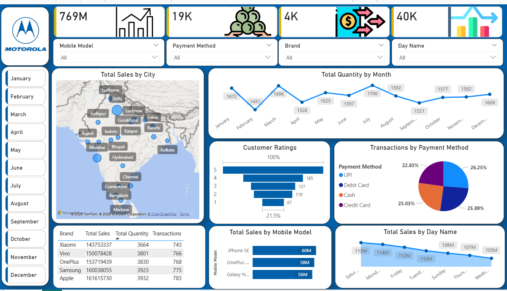

# 📊 Mobile Sales Dashboard – Power BI

## 📌 Project Overview

An interactive Mobile Sales Dashboard developed using Microsoft Power BI to analyze sales performance, transactions, customer ratings, payment methods, mobile models, brands, cities, and monthly sales trends.

The dashboard provides an interactive view of business performance through KPI cards, charts, maps, and slicers.

---

## 📸 Dashboard Preview

---

## 🛠️ Tools & Technologies

- Microsoft Power BI
- Power Query
- DAX
- Data Cleaning
- Data Transformation
- Data Visualization
- Interactive Slicers
- Business Intelligence

---

## 📊 Dashboard Features

### Key Performance Indicators

- Total Sales
- Total Quantity
- Total Transactions

### Sales Analysis

- Sales by City
- Sales by Mobile Model
- Monthly Sales Trends
- Sales by Day of Week

### Customer Analysis

- Customer Ratings
- Rating Distribution

### Transaction Analysis

- Transactions by Payment Method
- Payment Method Distribution

### Interactive Filters

- Brand
- Mobile Model
- Payment Method
- Day Name
- Month

---

## 📈 Key Insights

- Analyzed mobile sales performance across different brands and models.
- Compared sales performance across cities.
- Identified monthly sales and quantity trends.
- Analyzed customer rating distribution.
- Compared transaction volumes across different payment methods.
- Examined sales patterns across different days of the week.

---

## 📂 Project Files

| File | Description |
|---|---|
| `Mobile_Sales_Dashboard.pbix` | Power BI Desktop project file |
| `mobile-sales-dashboard.png` | Dashboard preview |

---

## 🎯 Project Objective

The objective of this project is to transform mobile sales data into an interactive business intelligence dashboard that helps users understand sales performance, customer behavior, transaction patterns, and product performance.

---

## 👩‍💻 Author

**Arzu**

Aspiring Data Analyst | Data Scientist | AI Enthusiast

GitHub: [arju3610](https://github.com/arju3610)
